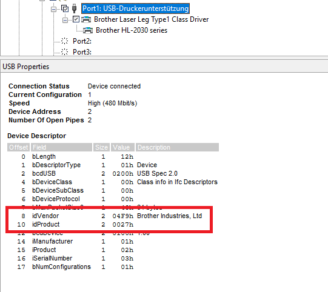
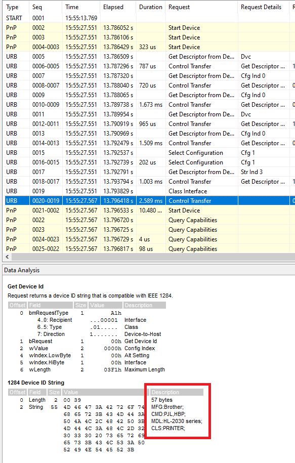

# How to capture the PNP string of a printer

---
**NOTE**

The PNP string comes with some synonyms:  
  **PNP string**  Used in this project, the *g_printer* module  
  **ieee 1284 string** Used in the USB specification  
  **device id** Used in the USB specification  
  ... maybe more?

---

The PNP string is send by your printer during the USB enumeration, 
which happens the moment you connect the printer to a pc or any other USB host.
To be able to capture the PNP string using your Windows machine, you need some kind of USB traffic analyzer.
I used *USBlyzer* version 2.2 which comes with a 30 day trial [download](https://www.usblyzer.com/download.htm).
For *USBlyzer* you want to the the following:

1. Install and start *USBlyzer*
2. Capture Hot-plugged devices
   - Open "Capture" menu in top menu bar
   - Confirm "Capture Hot-plugged" is checked
   - Start capture traffic (At this moment there shouldn't be any traffic)
3. Connect the printer to a USB port
   - As soon as you connect the printer, messages should come in!
4. Get vendor ID and product ID
   - Select printer in *Device Tree*
   - Note idVendor and idProduct as hex (e.g. 0x04F9 for Brother Industries, Ltd)
   
5. Get PNP string
   - Search in received messages for *Get Device Id* Request
   - The payload of this message should contain the needed PNP string
   - **NOTE** Some printers, especially modern multifunction printers might not send
   the device id during the enumeration. This happened to me with a *HP 8710*. I haven't
   figured out how to get the PNP string of these printers. 
   
6. Call *g_printer* as described in [README](https://github.com/Raspberryy/Emulated_USB_Printer/blob/main/README.md)

#### Linux users might want to use different tools :)
